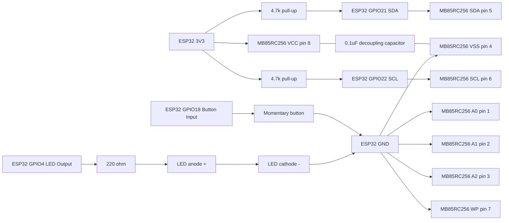

# MB85RC256 + ESP32 Wiring Diagram

This wiring matches the configuration in esphome-web-6f61b4.yaml:
- I2C SDA: GPIO21
- I2C SCL: GPIO22
- Button input: GPIO18
- LED output: GPIO4

## Parts

- 1x ESP32 dev board
- 1x MB85RC256 (MB85RC256V) FRAM breakout or IC
- 1x LED
- 1x momentary push button
- 2x 4.7k resistor (I2C pull-ups)
- 1x 10k resistor (button pull-up, only needed if not using internal pull-up)
- 1x 220 ohm resistor (LED current limit)
- 1x 0.1uF ceramic capacitor (FRAM decoupling)

## Connection Table

| Signal | ESP32 Pin | MB85RC256 Pin | Notes |
|---|---|---|---|
| 3V3 | 3V3 | VCC (pin 8) | FRAM power |
| GND | GND | VSS (pin 4) | Common ground |
| SDA | GPIO21 | SDA (pin 5) | Add 4.7k pull-up to 3V3 |
| SCL | GPIO22 | SCL (pin 6) | Add 4.7k pull-up to 3V3 |
| A0 | - | A0 (pin 1) | Tie to GND |
| A1 | - | A1 (pin 2) | Tie to GND |
| A2 | - | A2 (pin 3) | Tie to GND |
| WP | - | WP (pin 7) | Tie to GND (write enabled) |

## LED Wiring

- GPIO4 -> 220 ohm resistor -> LED anode (+)
- LED cathode (-) -> GND

## Button Wiring

Option A (recommended, used by current YAML):
- One side of button -> GPIO18
- Other side of button -> GND
- Internal pull-up is enabled in YAML

Option B (external pull-up):
- One side of button -> GPIO18
- Other side of button -> GND
- 10k resistor from GPIO18 -> 3V3

## Decoupling Capacitor

- Place a 0.1uF capacitor as close as possible between MB85RC256 VCC (pin 8) and GND (pin 4).

## Mermaid Diagram

Notes:
- MB85RC256 address is 0x50 when A0/A1/A2 are all tied to GND.
- ESPHome state persistence is handled directly in lambdas via ESPHome I2C bus reads/writes to MB85RC256 addresses 0x0000 and 0x0001.
- If your FRAM module already has I2C pull-ups, do not add extra pull-ups in parallel unless needed.
